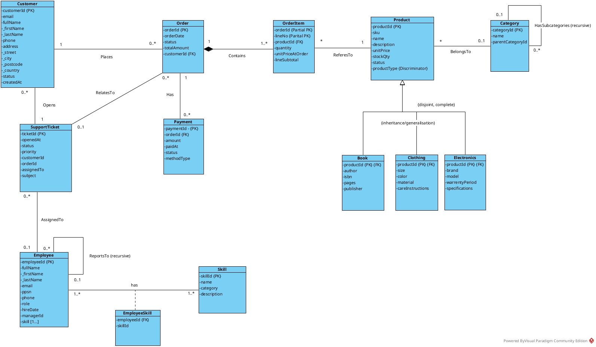

# Database Design Document


**Kristian Colville**

**W20114790**

**Databases**

**11/10/2025**

## Table of Contents

- [Revision History](#revision-history)
- [1. Purpose](#1-purpose)
  - [1.1 Document Objectives](#11-document-objectives)
  - [1.2 Scope of activities](#12-scope-of-activities)
  - [1.3 Intended Audience](#13-intended-audience)
  - [1.4 Methodology](#14-methodology)
- [2. System Description](#2-system-description)
  - [2.1 Problem Domain and Contextual Background](#21-problem-domain-and-contextual-background)
  - [2.2 Stakeholders and User Requirements](#22-stakeholders-and-user-requirements)
  - [2.3 Objects of Interest (Entities) and Their Roles](#23-objects-of-interest-entities-and-their-roles)
  - [2.4 Relationships Among Objects](#24-relationships-among-objects)
  - [2.5 Functional Requirements (Transactions, Operations, Queries)](#25-functional-requirements-transactions-operations-queries)
  - [2.6 Assumptions, Constraints, and Dependencies](#26-assumptions-constraints-and-dependencies)
- [3. Conceptual Data Model](#3-conceptual-data-model)
  - [3.1 Rationale for Chosen Modelling Approach](#31-rationale-for-chosen-modelling-approach)
  - [3.2 Entity Definitions and Attributes](#32-entity-definitions-and-attributes)
  - [3.3 Relationships and Cardinalities](#33-relationships-and-cardinalities)
  - [3.4 Constraints and Business Rules (conceptual level)](#34-constraints-and-business-rules-conceptual-level)
  - [3.5 Advanced Data Modelling Features](#35-advanced-data-modelling-features)
  - [3.6 Conceptual ER Diagram (annotated)](#36-conceptual-er-diagram-annotated)
- [4. Logical Data Model](#4-logical-data-model)
  - [4.1 Mapping Process from Conceptual to Logical](#41-mapping-process-from-conceptual-to-logical)
  - [4.2 Relational Schema (Tables, Primary Keys, Foreign Keys)](#42-relational-schema-tables-primary-keys-foreign-keys)
  - [4.3 Normalisation and Justification (1NF → 3NF or BCNF if applicable)](#43-normalisation-and-justification-1nf--3nf-or-bcnf-if-applicable)
  - [4.4 Integrity Constraints (domain, entity, referential)](#44-integrity-constraints-domain-entity-referential)
  - [4.5 Logical ER Diagram / Relational Diagram](#45-logical-er-diagram--relational-diagram)
  - [4.6 Example SQL Definitions (CREATE TABLE statements with constraints)](#46-example-sql-definitions-create-table-statements-with-constraints)
- [5. Conclusion](#5-conclusion)
  - [5.1 Summary of Design Outcomes](#51-summary-of-design-outcomes)
  - [5.2 Limitations of the Current Design](#52-limitations-of-the-current-design)
  - [5.3 Next Steps Toward Implementation and Testing](#53-next-steps-toward-implementation-and-testing)
- [Acronyms and Abbreviations](#acronyms-and-abbreviations)
- [Appendices](#appendices)

## Revision History

| Date       | Version | Author         | Change/Note                                                                                                               |
| ---------- | ------- | -------------- | ------------------------------------------------------------------------------------------------------------------------- |
| 28-09-2025 | 0.1     | Document Owner | Initial draft, rough outline with table of contents. Prepping sections and overall information to be included.            |
| 28-09-2025 | 0.1.1   | Document Owner | Defined purpose, edited and drafted section 1.                                                                            |
| 01-10-2025 | 0.2     | Document Owner | Started Section 2, chose problem domain for assignment.                                                                   |
| 01-10-2025 | 0.2.1   | Document Owner | Extracted database user requirements from the problem domain.                                                             |
| 02-10-2025 | 0.2.2   | Document Owner | Created table for objects of interest and formatted.                                                                      |
| 02-10-2025 | 0.2.3   | Document Owner | Started working on the relationships and formatting for table.                                                            |
| 02-10-2025 | 0.2.4   | Document Owner | Prepared half of section 2 for proof reading and editing. Relationship participations to be checked over again.           |
| 02-10-2025 | 0.2.5   | Document Owner | Converted document to markdown file with libre office and set up github repo for project. I hate word.                    |
| 02-10-2025 | 0.3     | Document Owner | Started working on drafting section 3 and figuring out what to do next.                                                   |
| 05-10-2025 | 0.3.1   | Document Owner | Proofing document. Identified several formatting issues to fix.                                                           |
| 05-10-2025 | 0.4     | Document Owner | Identified redundancy between sections 2 and 3 - detailed technical specs were repeated.                                  |
| 05-10-2025 | 0.4.1   | Document Owner | Moved detailed entity attributes and cardinalities from Section 2 to Section 4 (Logical Data Model).                      |
| 05-10-2025 | 0.4.2   | Document Owner | Rewrote Section 2.3 and 2.4 to be business-focused and conceptual only.                                                   |
| 05-10-2025 | 0.4.3   | Document Owner | Updated Section 3.2 to provide proper conceptual entity definitions.                                                      |
| 05-10-2025 | 0.4.4   | Document Owner | Created Section 4 (Logical Data Model) with all detailed technical specifications.                                        |
| 05-10-2025 | 0.4.5   | Document Owner | Document now follows proper DDD conventions with clear separation between business concepts and technical implementation. |
| 05-10-2025 | 0.4.6   | Document Owner | Added subtype/supertype pattern for products and edited sections 2 to 4.                                                  |
| 05-10-2025 | 0.5     | Document Owner | Edited section 4 and added data from research and the problem domain for normalisation.                                   |
| 11-10-2025 | 0.6     | Document Owner | Removed security considerations from introduction section.                                                                |
| 11-10-2025 | 0.7     | Document Owner | Added conceptual er diagram and added multivalued attribute skill for employee entity.                                    |

## 1. Purpose

The Database Design Document explains how the information structure of the system is turned into an actual working database. The purpose is to take the ideas and relationships defined early in the planning stages and show how they will be built in the database software we use. It bridges the gap between the blueprint of the data and the way that data will be stored, organised and accessed.

The document also considers how the database will perform in production. It will look at the system and examine how it will be used day to day and make sure that the design supports the use case. We are taking an abstract design and moving it into a practical one. The DDD ensures that the system can handle the problem domain while keeping information structured and easy to work with.

### 1.1 Document Objectives

The DDD has the following objects:

1. Describe the design
2. Basis for implementation
3. Offer a clear road map for development

### 1.2 Scope of activities

The scope of activities that resulted in the development of the DDD.

- **Research and review** – Studied sample data and existing DDDs to understand common practices, structures, and usage.
- **Document structuring** – Organised formatting and content flow, ensuring logical relationships between sections and a clear, navigable layout.
- **Problem domain exploration** – Analysed the business context and requirements to ensure the design aligns with real-world needs.
- **Tools and techniques** – Identified and applied the appropriate methods, software, and frameworks to support the design process.
- **Language specification research** – Ensured accurate use of terminology and consistency with technical and project standards.
- **Requirements gathering** – Captured functional and non-functional needs to inform the database design.
- **Project planning and time management** – Scheduled tasks and milestones to complete Version 1 of the document

### 1.3 Intended Audience

This document is intended for the following audiences:

- **Technical reviewers** – To evaluate the structure, accuracy, and completeness of the database design.
- **Developers** – To use the document as a guide during the implementation and testing phases.
- **Administrators** – To understand how the database will be maintained, optimised, and supported in practice.
- **Assessors** – To review the document as part of the evaluation process, ensuring it demonstrates understanding of database design principles and application.

### 1.4 Methodology

The development of this DDD was a gradual, step-by-step process that relied on research and careful planning. It began with a simple table of contents that acted as a roadmap, helping to organise the work in a clear and logical order. Throughout the process, I looked at similar documents and reference materials to understand common approaches and to make sure the final version met professional standards.

The document came together in stages. Early drafts focused on broad ideas and general details that are typical for projects like this. These were later refined and shaped around the specific problem area chosen for the module. As the work moved forward, I started applying database design methods, such as creating and updating Entity Relationship Diagrams, to make sure the design matched the requirements.

A revision history was kept to record updates and improvements as the document developed. The drafting process was managed alongside the project timeline, with the goal of not only meeting the document’s requirements but also showing how database design techniques can be used in practice.

## 2. System Description

This section provides a comprehensive overview of the business system that the database will support. It identifies the problem domain, key stakeholders, business entities, and functional requirements that drive the database design. The system description serves as the foundation for the conceptual and logical data models that follow, ensuring that the database design aligns with real-world business needs and operational requirements.

The analysis covers the e-commerce platform's current challenges, user requirements, and business processes that must be supported by the database system. This business-focused perspective ensures that the subsequent technical design decisions are grounded in actual operational needs rather than abstract database theory.

### 2.1 Problem Domain and Contextual Background

This project involves designing a database for Kristian's Cool Shop, an e-commerce platform specializing in unique and novelty products. The business has experienced significant growth, but the current database architecture is unable to scale effectively to meet increased demand.

**Current System Challenges:**

- Performance degradation during peak traffic periods
- Inadequate support for concurrent user operations
- Limited scalability for growing product catalog and customer base
- Inefficient data structures causing slow query response times
- Inflexible product data model unable to accommodate category-specific attributes
- Single product table forces all items to use identical attribute structure regardless of product type

**Business Requirements:**
The new database design must support a modern e-commerce platform capable of handling:

- High-volume transaction processing
- Real-time inventory management
- Multi-user concurrent access
- Comprehensive customer relationship management
- Integrated payment processing
- Customer support ticket management

**Migration Objectives:**
The database redesign aims to create a scalable and normalised structure that supports current operations while providing a solid foundation for future growth. The new design introduces well-defined entity relationships, data integrity constraints, and optimised data structures to address the performance and scalability limitations of the existing system.

### 2.2 Stakeholders and User Requirements

Several key stakeholder groups interact with the system, each with their own specific requirements:

- **Customers**

  - Browse and search for products.
  - Place and track orders.
  - Manage account information (e.g., contact details, payment methods).
- **Store Administrators**

  - Manage product listings (add, update, or remove items).
  - Manage category-specific product attributes (e.g., size for clothing, brand for electronics).
  - Monitor sales and generate reports.
  - Control user permissions and system settings.
- **Customer Support Agents**

  - Access customer order histories to resolve queries.
  - Track and update support tickets.
  - Communicate with customers about order issues.
- **Management**

  - Analyse sales data for business insights.
  - Monitor system usage and performance.
  - Ensure compliance with security and privacy standards.

From these roles, the following user requirements were identified:

1. The system must record customers, products, and orders with clear relationships.
2. The system must allow customers to place and track orders.
3. Administrators must be able to update product and inventory information.
4. Customer support must be able to link queries and tickets to specific orders or accounts.
5. Management must be able to generate queries and reports.
6. The system must support different product types with specialized attributes while maintaining data integrity.

### 2.3 Objects of Interest (Entities) and Their Roles

This section identifies the primary business entities that the system must manage. These entities represent the core concepts and objects that exist within Kristian's Cool Shop's business domain. The focus here is on understanding what business objects need to be tracked and managed, rather than the technical details of how they will be implemented.

| Entity                  | Business Role                                            | Key Business Concept                                 |
| ----------------------- | -------------------------------------------------------- | ---------------------------------------------------- |
| **Customer**      | People who interact with the store                       | Individuals who browse, purchase, and seek support   |
| **Product**       | Core product information shared across all product types | Common attributes for all merchandise in inventory   |
| **Electronics**   | Electronic products with specialized attributes          | Brand, model, warranty specifications for tech items |
| **Clothing**      | Apparel items with size and material attributes          | Size, colour, material details for clothing items    |
| **Books**         | Publications with author and publisher information       | Author, ISBN, publisher details for book items       |
| **Category**      | Product organisation system                              | Hierarchical structure for organising products       |
| **Order**         | Customer purchase transactions                           | Records of what customers have bought                |
| **OrderItem**     | Individual products within orders                        | Line-level details of each product in a purchase     |
| **Payment**       | Financial transactions                                   | Records of how orders were paid                      |
| **SupportTicket** | Customer service interactions                            | Issues and requests from customers                   |
| **Employee**      | Staff members                                            | People who manage the system and provide support     |
| **Skill**         | Employee competencies and capabilities                   | Standardised skills that employees possess           |

### 2.4 Relationships Among Objects

This section describes the key business relationships between entities, focusing on how the business objects interact and depend on each other. The relationships are described conceptually to understand the business logic and constraints.

| Relationship                       | Business Description                            | Key Business Rule                                                             |
| ---------------------------------- | ----------------------------------------------- | ----------------------------------------------------------------------------- |
| Customer places Order              | Customers can make purchases                    | Every order must be associated with a customer                                |
| Order contains Products            | Orders can include multiple products            | Orders track which products were purchased and in what quantities             |
| Product belongs to Category        | Products can be organised into categories       | Products may be categorised to help customers find items                      |
| Product has specialised attributes | Products can have type-specific details         | Products must belong to exactly one subtype (Electronics, Clothing, or Books) |
| Category has subcategories         | Categories can be organised hierarchically      | Categories can have parent-child relationships for better organisation        |
| Order has Payment                  | Orders must be paid for                         | Orders can have associated payment records                                    |
| Customer opens SupportTicket       | Customers can request help                      | Support tickets are always linked to a customer                               |
| SupportTicket relates to Order     | Support issues may be about specific orders     | Support tickets can optionally reference specific orders                      |
| Employee handles SupportTicket     | Staff members can be assigned to resolve issues | Support tickets can be assigned to employees for resolution                   |
| Employee reports to Employee       | Staff have management relationships             | Employees can have supervisors in the organisational structure                |

### 2.5 Functional Requirements (Transactions, Operations, Queries)

This section outlines the key functional requirements of Kristian's Cool Shop. These requirements describe the operations the database must support for different stakeholders, including customers, administrators, and support staff. They are expressed as typical transactions or queries that demonstrate how the database will be used in practice.

| Requirement                       | Stakeholder       | Example Transaction / Query                                                                           |
| --------------------------------- | ----------------- | ----------------------------------------------------------------------------------------------------- |
| Place a new order                 | Customer          | Insert a new record into Order, with related OrderItem rows referencing selected Products.            |
| View order history                | Customer          | `SELECT * FROM Order WHERE CustomerID = ? ORDER BY OrderDate DESC;`                                 |
| Update stock levels               | Administrator     | `UPDATE Product SET StockQty = StockQty - ? WHERE ProductID = ?;`                                   |
| Generate sales report             | Management        | `SELECT ProductID, SUM(Quantity) FROM OrderItem GROUP BY ProductID;`                                |
| Manage product listings           | Administrator     | Insert, update, or delete rows in Product and assign them to a Category.                              |
| Manage product subtypes           | Administrator     | Insert, update, or delete rows in Electronics, Clothing, or Books tables with appropriate attributes. |
| Validate product type consistency | System            | Ensure Product.ProductType matches the corresponding subtype table (Electronics, Clothing, or Books). |
| Record a payment                  | Customer / System | Insert into Payment (with subtype row in CardPayment or PayPalPayment) linked to an Order.            |
| Track unresolved support tickets  | Support Agent     | `SELECT * FROM SupportTicket WHERE Status = 'Open' AND AssignedTo IS NULL;`                         |
| Escalate a ticket                 | Support Agent     | Update SupportTicket with new EmployeeID (manager assignment).                                        |
| Analyse staff workload            | Management        | Count how many SupportTickets are assigned to each Employee.                                          |

### 2.6 Assumptions, Constraints, and Dependencies

**Assumptions**

* Customers are required to register before placing an order (guest checkouts are not considered).
* Each order must contain at least one product.
* Payments are assumed to succeed once recorded; payment gateway errors are handled outside the database.
* Support tickets are always linked to a customer account, but linking them to a specific order is optional.

**Constraints**

* Primary keys must uniquely identify every entity (e.g., CustomerID, OrderID).
* Foreign key constraints enforce valid relationships (e.g., every Order must reference a valid Customer).
* Composite attributes, such as Customer Address, will be normalised into separate fields (Street, City, Postcode, Country) for clarity.
* OrderItem is a weak entity and cannot exist without its parent Order.
* Subtypes of Payment (CardPayment, PayPalPayment) enforce disjointness — a payment record must belong to exactly one subtype.
* Products must be assigned to exactly one product type (Electronics, Clothing, or Books).
* Subtype attributes are only applicable to products of the corresponding type.

**Dependencies**

* The database design assumes integration with an external payment system.
* Customer support processes depend on staff availability; the database only manages tickets and assignments, not communication channels.
* Product categories may be hierarchical; the recursive relationship assumes front-end or business logic prevents circular dependencies.
* Reporting and analytics queries depend on accurate and consistent transaction data being recorded in real time.

## 3. Conceptual Data Model

The Conceptual Data Model represents the high-level view of Kristian's Cool Shop database, focusing on the essential entities, their attributes, and relationships without concern for implementation details. This section translates the business requirements from Section 2 into a formal data model that demonstrates the complexity and relationships needed to support the e-commerce platform's operations.

The model incorporates several advanced database concepts to handle the real-world complexity of the system, including weak entities for order line items, recursive relationships for hierarchical categories and employee management, and subtype/supertype structures for different payment methods.

### 3.1 Rationale for Chosen Modelling Approach

The Unified Modelling Language (UML) class diagram approach was selected for developing the conceptual data model of Kristian's Cool Shop. This choice was made after initially exploring traditional Entity-Relationship (ER) diagram notations and evaluating their suitability for this project.

**Exploration of Modelling Approaches:**

During the initial design phase, both traditional ER diagrams (Chen notation) and UML class diagrams were considered. Research into the differences between these approaches, particularly from [GeeksforGeeks&#39; comparison of UML and ER diagrams](https://www.geeksforgeeks.org/dbms/difference-between-uml-and-er-diagram/), highlighted key distinctions: "UML is a general modelling language which is used to visualise the design of a software system" whilst "ER Diagram is a pictorial representation of the real-world entities and their relationships with each other" (GeeksforGeeks, 2025).

After creating initial diagrams using both notations, UML class diagrams were preferred based on guidance from the database module course lectures, which demonstrated UML's effectiveness for database design. The standardised notation and comprehensive support for advanced database concepts made UML the more suitable choice for this project.

**Why UML Class Diagrams Are Appropriate:**

UML class diagrams provide a standardised notation that effectively represents entities (as classes), attributes, and relationships (as associations). The notation supports the advanced database concepts required for this e-commerce system, including weak entities (via composition), recursive relationships (self-associations), and subtype/supertype structures (inheritance hierarchies).

**Tool Selection: Visual Paradigm**

Visual Paradigm was chosen as the modelling tool due to its comprehensive UML 2.x support, database-specific extensions for entity relationship modelling, and ability to generate SQL DDL statements directly from diagrams. The tool is widely used in academic contexts and provides clear, professional diagram outputs suitable for documentation.

**Key Benefits for This Project:**

UML class diagrams address the specific requirements of this database design:

- **Weak Entities**: OrderItem is represented through composition relationships (filled diamond notation)
- **Recursive Relationships**: Self-associations with clear role names for Category hierarchy and Employee management
- **Subtype/Supertype Structures**: Generalisation/specialisation hierarchies for Product subtypes (Electronics, Clothing, Books)
- **Multiplicity Constraints**: Precise cardinality notation (1, 0..1, 1..*, 0..*) for relationship participation

This approach provides a clear conceptual model that transitions effectively to the logical and physical implementation phases whilst maintaining consistency with modern database design practices.

### 3.2 Entity Definitions and Attributes

This section provides conceptual definitions of each entity in the data model, focusing on their business purpose and key characteristics rather than technical implementation details. The entities are defined from a business perspective to ensure the conceptual model accurately represents the real-world system.

<details>
<summary><strong>Customer Entity</strong></summary>

**Business Definition**: Represents individuals who interact with Kristian's Cool Shop, including browsers, purchasers, and support requesters. Customers are the central actors in the e-commerce system and must be registered to place orders.

**Key Business Characteristics**:

- Each customer has a unique identity within the system
- Customers can exist independently of orders (they may browse without purchasing)
- Customer information is required for order processing and support
- Customers can have multiple orders over time

**Conceptual Attributes**:

The following attributes are required to support the business operations identified in the system requirements:

- **CustomerID**: Unique identifier needed to distinguish between different customer accounts and maintain referential integrity across orders and support tickets.
- **Email**: Essential for customer authentication, account management, and communication regarding orders and account status.
- **FullName**: Required to personally identify customers for order processing, delivery, and customer service interactions.
- **Phone**: Optional contact information that enables customer support staff to reach customers regarding order issues or account matters.
- **Address**: Composite attribute representing the customer's delivery location, consisting of street address, city, postal code, and country. Required for order fulfilment and shipping.
- **CreatedAt**: Timestamp recording when the customer account was established, supporting audit trails and customer lifecycle analysis.
- **Status**: Indicates the current state of the customer account (Active, Suspended, Inactive), enabling the system to control access and manage account lifecycle.

</details>

<details>
<summary><strong>Product Entity (Supertype)</strong></summary>

**Business Definition**: Represents the core product information shared across all product types in the online store. This entity serves as the supertype that contains common attributes for all merchandise, while specialized attributes are managed through subtype entities.

**Key Business Characteristics**:

- Each product has a unique business identifier (SKU)
- Products exist independently of orders (inventory items)
- Products can be organized into categories for better customer navigation
- Product information includes pricing and availability status
- Every product must belong to exactly one subtype (Electronics, Clothing, or Books)
- Common attributes are stored in the supertype, specialized attributes in subtypes

**Conceptual Attributes**:

The following attributes are required to support product management and sales operations:

- **ProductID**: Unique system identifier for each product, enabling referential integrity with orders and categories.
- **SKU**: Stock Keeping Unit, a unique business identifier used for inventory management and tracking.
- **Name**: The product name as displayed to customers, essential for browsing and searching.
- **Description**: Detailed product information helping customers make informed purchasing decisions.
- **UnitPrice**: The current selling price of the product, required for order processing and revenue calculation.
- **StockQty**: Current inventory quantity, enabling stock management and preventing overselling.
- **Status**: Indicates product availability (Active, Discontinued, Out of Stock), controlling whether products can be ordered.
- **ProductType**: Discriminator attribute identifying which subtype (Electronics, Clothing, Books) the product belongs to, ensuring proper specialisation.

</details>

<details>
<summary><strong>Electronics Entity (Subtype)</strong></summary>

**Business Definition**: Represents electronic products with specialized attributes specific to technology items. This subtype contains attributes that are only relevant to electronic products.

**Key Business Characteristics**:

- Contains brand, model, and warranty information for electronic items
- Dependent on the Product supertype for core product information
- Attributes are only applicable to products classified as electronics
- Supports detailed product specifications for technical items

**Conceptual Attributes**:

Specialised attributes for electronic products:

- **ProductID**: Links to the parent Product entity, serving as both primary key and foreign key to maintain the generalisation relationship.
- **Brand**: The manufacturer or brand name, important for customer purchasing decisions and product categorisation.
- **Model**: Specific model number or name, distinguishing between variants from the same manufacturer.
- **WarrantyPeriod**: Duration of warranty coverage in months, essential for customer assurance and after-sales support.
- **Specifications**: Technical details such as processor speed, memory, screen size, etc., helping customers evaluate technical products.

</details>

<details>
<summary><strong>Clothing Entity (Subtype)</strong></summary>

**Business Definition**: Represents apparel items with specialized attributes specific to clothing and fashion items. This subtype contains attributes that are only relevant to clothing products.

**Key Business Characteristics**:

- Contains size, colour, material, and care instruction information
- Dependent on the Product supertype for core product information
- Attributes are only applicable to products classified as clothing
- Supports detailed product specifications for fashion items

**Conceptual Attributes**:

Specialised attributes for clothing products:

- **ProductID**: Links to the parent Product entity, serving as both primary key and foreign key to maintain the generalisation relationship.
- **Size**: The garment size (S, M, L, XL, etc.), essential for customers to select properly fitting items.
- **Color**: The primary colour of the clothing item, important for customer preference and visual identification.
- **Material**: Fabric composition (cotton, polyester, wool, etc.), helping customers with material preferences and care requirements.
- **CareInstructions**: Washing and maintenance guidelines, ensuring customers can properly care for their garments.

</details>

<details>
<summary><strong>Books Entity (Subtype)</strong></summary>

**Business Definition**: Represents publications with specialized attributes specific to books and printed materials. This subtype contains attributes that are only relevant to book products.

**Key Business Characteristics**:

- Contains author, ISBN, publisher, and page count information
- Dependent on the Product supertype for core product information
- Attributes are only applicable to products classified as books
- Supports detailed product specifications for literary items

**Conceptual Attributes**:

Specialised attributes for book products:

- **ProductID**: Links to the parent Product entity, serving as both primary key and foreign key to maintain the generalisation relationship.
- **Author**: The book's author name, crucial for customer searches and literary categorisation.
- **ISBN**: International Standard Book Number, a unique identifier for the publication used in the book industry.
- **Pages**: Total page count, giving customers an indication of the book's length.
- **Publisher**: The publishing company, relevant for customers and industry cataloguing.

</details>

<details>
<summary><strong>Category Entity</strong></summary>

**Business Definition**: Represents the organizational structure used to group and classify products. Categories help customers navigate the product catalog and find items of interest.

**Key Business Characteristics**:

- Categories can be organized hierarchically (parent-child relationships)
- Categories can exist independently of products (empty categories are allowed)
- The category structure supports flexible product organization
- Categories help customers browse and filter products

**Conceptual Attributes**:

The following attributes support the hierarchical product organisation system:

- **CategoryID**: Unique identifier for each category, enabling referential integrity with products and parent categories.
- **Name**: The category name displayed to customers, used for navigation and browsing.
- **ParentCategoryID**: Reference to another category, enabling hierarchical organisation (e.g., Electronics > Laptops > Gaming Laptops). This recursive relationship allows unlimited levels of categorisation.

</details>

<details>
<summary><strong>Order Entity</strong></summary>

**Business Definition**: Represents a customer's purchase transaction. Orders capture the business event of a customer deciding to buy products from the store.

**Key Business Characteristics**:

- Every order must be associated with a customer
- Orders represent the business transaction, not just a shopping cart
- Orders have a lifecycle from creation to completion
- Orders can contain multiple products with different quantities

**Conceptual Attributes**:

The following attributes support order processing and tracking:

- **OrderID**: Unique identifier for each order, serving as the primary key and enabling tracking throughout the order lifecycle.
- **OrderDate**: Timestamp recording when the order was placed, essential for order tracking, reporting, and customer service.
- **Status**: Indicates the current stage in the order lifecycle (Pending, Processing, Shipped, Delivered, Cancelled), enabling process tracking and customer communication.
- **TotalAmount**: The total monetary value of the order, calculated from all order items, required for payment processing and financial reporting.
- **CustomerID**: Reference to the customer who placed the order, establishing the mandatory relationship between orders and customers.

</details>

<details>
<summary><strong>OrderItem Entity (Weak Entity)</strong></summary>

**Business Definition**: Represents individual products within an order, capturing the specific details of what was purchased. OrderItems are dependent on their parent order and cannot exist independently.

**Key Business Characteristics**:

- OrderItems have no meaning without their parent order
- Each OrderItem captures the quantity and pricing at the time of purchase
- OrderItems preserve historical pricing information
- OrderItems resolve the many-to-many relationship between orders and products

**Conceptual Attributes**:

The following attributes capture line-level order details:

- **OrderID**: Part of the composite primary key and foreign key to the parent Order, establishing the existence dependency that makes this a weak entity.
- **LineNo**: Sequential line number within the order, forming the discriminator (partial key) that uniquely identifies items within a specific order.
- **ProductID**: Reference to the product being purchased, linking the order item to the product catalogue.
- **Quantity**: Number of units of this product in the order, required for inventory management and fulfilment.
- **UnitPriceAtOrder**: The price per unit at the time the order was placed, preserving historical pricing information even if current product prices change.
- **LineSubtotal**: Calculated value (Quantity × UnitPriceAtOrder), representing the total cost for this line item.

</details>

<details>
<summary><strong>Payment Entity</strong></summary>

**Business Definition**: Represents financial transactions associated with orders. Payments record how customers pay for their purchases and support multiple payment methods.

**Key Business Characteristics**:

- Every payment must be associated with an order
- Payments can be processed after order creation
- Different payment methods may have different characteristics
- Payment records support financial reconciliation and reporting

**Conceptual Attributes**:

The following attributes track payment transactions:

- **PaymentID**: Unique identifier for each payment transaction, serving as the primary key.
- **OrderID**: Reference to the order being paid, establishing the mandatory relationship between payments and orders.
- **Amount**: The monetary value of the payment, required for financial tracking and reconciliation.
- **PaidAt**: Timestamp recording when the payment was processed, essential for financial reporting and order fulfilment triggers.
- **Status**: Indicates the payment state (Pending, Completed, Failed, Refunded), tracking the payment lifecycle and enabling appropriate business actions.
- **MethodType**: Indicates the payment method category (Card, PayPal, Bank Transfer), supporting different payment processing workflows.

</details>

<details>
<summary><strong>SupportTicket Entity</strong></summary>

**Business Definition**: Represents customer service interactions and issues. SupportTickets manage the communication and resolution process between customers and support staff.

**Key Business Characteristics**:

- Every support ticket must be associated with a customer
- Support tickets can optionally reference specific orders
- Support tickets can be assigned to employees for resolution
- Support tickets have a lifecycle from creation to resolution

**Conceptual Attributes**:

The following attributes manage customer support interactions:

- **TicketID**: Unique identifier for each support ticket, serving as the primary key and reference number.
- **OpenedAt**: Timestamp recording when the ticket was created, tracking response times and service level agreements.
- **Status**: Indicates the ticket's state (Open, In Progress, Resolved, Closed), managing the support workflow and tracking resolution progress.
- **Priority**: Indicates urgency level (Low, Medium, High, Critical), enabling appropriate resource allocation and response prioritisation.
- **CustomerID**: Reference to the customer who opened the ticket, establishing the mandatory relationship.
- **OrderID**: Optional reference to a related order, providing context when issues concern specific purchases.
- **AssignedTo**: Reference to the employee handling the ticket, enabling workload management and accountability.
- **Subject**: Brief description of the issue, providing quick identification and categorisation.

</details>

<details>
<summary><strong>Employee Entity</strong></summary>

**Business Definition**: Represents staff members who manage the system, handle customer support, and perform administrative functions. Employees are the internal users of the system.

**Key Business Characteristics**:

- Employees can be assigned to handle support tickets
- Employees can have management relationships (supervisor-subordinate)
- Employees have different roles and responsibilities
- Employee information supports workload management and escalation

**Conceptual Attributes**:

The following attributes support employee management and operations:

- **EmployeeID**: Unique identifier for each employee, serving as the primary key and enabling referential integrity across ticket assignments and management hierarchies.
- **FullName**: The employee's complete name, used for identification and communication.
- **Email**: Work email address for system access and business communication, must be unique for authentication purposes.
- **PPSN**: Personal Public Service Number, the Irish national identifier required for payroll, tax, and social welfare purposes. Unique to each employee.
- **Phone**: Contact telephone number for internal communication and emergency contact.
- **Role**: The employee's job function (Administrator, Support Agent, Manager), determining system permissions and responsibilities.
- **HireDate**: Date when the employee joined the organisation, supporting tenure tracking and HR reporting.
- **ManagerID**: Reference to another employee who serves as this employee's supervisor, establishing the management hierarchy through a recursive relationship.
- **Skills** (Multivalued): A collection of skills possessed by the employee (e.g., 'Customer Service', 'Technical Support', 'SQL', 'Python', 'Management'). This multivalued attribute enables skill-based ticket assignment and workforce capability tracking. Each employee can have multiple skills.

</details>

<details>
<summary><strong>Skill Entity</strong></summary>

**Business Definition**: Represents specific competencies and capabilities that employees possess. Skills are managed as a separate entity to enable standardisation, prevent duplication, and support workforce planning.

**Key Business Characteristics**:

- Skills exist independently and can be shared by multiple employees
- Standardised skill names ensure consistency in skill tracking
- Skills support workforce capability analysis and skill-based task assignment
- The many-to-many relationship between Employee and Skill is resolved through the EmployeeSkill associative entity

**Conceptual Attributes**:

The following attributes define organisational skills:

- **SkillID**: Unique identifier for each skill, serving as the primary key.
- **Name**: The name of the skill (e.g., 'Customer Service', 'SQL', 'Python', 'Management'), must be unique to prevent duplicate skill entries.
- **Category**: Optional categorisation of skills (e.g., 'Technical', 'Soft Skills', 'Management'), helping organise and group related skills.
- **Description**: Optional detailed description of the skill, clarifying what the skill encompasses.

</details>

### 3.3 Relationships and Cardinalities

This section defines the conceptual relationships between entities using UML class diagram notation. The cardinality constraints specify how many instances of one entity can be related to instances of another entity.

**UML Multiplicity Notation:**

- **1** = Exactly one
- **0..1** = Zero or one (optional)
- **1..\*** = One or more (at least one)
- **0..\*** = Zero or more (optional, many)
- **\*** = Many (shorthand for 0..\*)

**Participation Constraints** indicate whether entity participation in relationships is mandatory (total) or optional (partial):

- **Total Participation**: Every instance of the entity must participate in the relationship
- **Partial Participation**: Some instances of the entity may not participate in the relationship

These conceptual relationships will be implemented in the logical model through foreign key constraints, intermediate tables for many-to-many relationships, composition for weak entities, and generalisation/specialisation for subtypes.

| Relationship                             | Multiplicity  | Participation                          | Relationship Attributes      | Business Rule                                                                                                                  |
| ---------------------------------------- | ------------- | -------------------------------------- | ---------------------------- | ------------------------------------------------------------------------------------------------------------------------------ |
| Customer places Order                    | 1 to 0..\*    | Customer = partial, Order = total      |                              | Every order belongs to a customer; customers may exist without orders                                                          |
| Order contains Product (via OrderItem)   | M:N           | Both partial                           | Quantity, UnitPriceAtOrder   | Resolved through OrderItem weak entity (composition relationship)                                                              |
| Product belongs to Category              | 0..1 to\*     | Product = partial, Category = partial  |                              | Products may be uncategorised; categories may be empty                                                                         |
| Category has subcategories (recursive)   | 0..1 to 0..\* | Both partial                           |                              | Parent category can have multiple children; prevents circular references                                                       |
| Order has Payment                        | 1 to 1..\*    | Order = partial, Payment = total       | Amount, PaidAt, Status       | Orders can exist before payment; every payment belongs to an order                                                             |
| Customer opens SupportTicket             | 1 to 0..\*    | Customer = partial, Ticket = total     |                              | Every ticket belongs to a customer; customers may never open tickets                                                           |
| SupportTicket refers to Order            | 0..1 to 0..\* | Both partial                           |                              | Tickets may optionally reference specific orders for context                                                                   |
| SupportTicket assigned to Employee       | 0..1 to 0..\* | Both partial                           |                              | Tickets may be unassigned; employees may have no assigned tickets                                                              |
| Employee reports to Employee (recursive) | 0..1 to 0..\* | Both partial                           |                              | Management hierarchy; not all employees have subordinates or managers                                                          |
| Product specialises to Electronics       | 1 to 0..1     | Product = partial, Electronics = total | Brand, Model, WarrantyPeriod | Generalisation/specialisation relationship (inheritance)                                                                       |
| Product specialises to Clothing          | 1 to 0..1     | Product = partial, Clothing = total    | Size, Colour, Material       | Generalisation/specialisation relationship (inheritance)                                                                       |
| Product specialises to Books             | 1 to 0..1     | Product = partial, Books = total       | Author, ISBN, Publisher      | Generalisation/specialisation relationship (inheritance)                                                                       |
| Employee has Skills (via EmployeeSkill)  | M:N           | Both partial                           |                              | Resolved through EmployeeSkill associative entity; employees can have multiple skills, skills can belong to multiple employees |

### 3.4 Constraints and Business Rules (conceptual level)

This section defines the conceptual constraints and business rules that govern the data model at the conceptual level. These constraints ensure data integrity and enforce business logic before implementation in the logical model.

**Entity Constraints**

- **Uniqueness Constraints**: Each entity must have a unique identifier (CustomerID, ProductID, OrderID, etc.)
- **Existence Constraints**: Certain entities cannot exist without their parent entities (OrderItem requires Order)
- **Type Constraints**: Products must belong to exactly one subtype (Electronics, Clothing, or Books)

**Relationship Constraints**

- **Referential Integrity**: Every foreign key must reference a valid primary key
- **Cardinality Constraints**: Relationships must respect their defined cardinalities
- **Participation Constraints**: Total participation entities must always participate in their relationships
- **Disjointness Constraints**: Subtype entities are mutually exclusive (a product cannot be both Electronics and Clothing)

**Domain Constraints**

- **Value Constraints**: Status fields must use predefined values (Active, Inactive, Pending, etc.)
- **Range Constraints**: Quantities must be positive, prices must be non-negative
- **Format Constraints**: Email addresses must follow valid email format, phone numbers must be valid

**Business Rules**

- **Registration Requirement**: Customers must register before placing orders (no guest checkout)
- **Order Content**: Every order must contain at least one product
- **Payment Association**: Every payment must be associated with an order
- **Support Ticket Ownership**: Every support ticket must be associated with a customer
- **Product Type Consistency**: Product subtype attributes must match the product's assigned type
- **Hierarchical Integrity**: Category hierarchies cannot contain circular references
- **Employee Management**: Employee reporting relationships cannot create cycles

**Temporal Constraints**

- **Order Lifecycle**: Orders progress through defined states (Pending → Processing → Shipped → Delivered)
- **Payment Processing**: Payments can be processed after order creation
- **Support Ticket Lifecycle**: Tickets progress through defined states (Open → In Progress → Resolved → Closed)

These conceptual constraints will be implemented in the logical model through primary key constraints, foreign key constraints, check constraints, and application-level business logic validation.

### 3.5 Advanced Data Modelling Features

The conceptual data model incorporates several advanced database modelling concepts to handle the complexity of the e-commerce system:

- **Multivalued Attributes**: The Employee entity includes a multivalued Skills attribute, allowing each employee to possess multiple skills (e.g., 'Customer Service', 'Technical Support', 'SQL', 'Python'). This enables skill-based ticket assignment and workforce capability tracking. In the logical model, this multivalued attribute is resolved into a separate EmployeeSkill table with a composite primary key (EmployeeID, Skill).
- **Recursive Relationships**: Self-referencing relationships model hierarchical structures. The Category entity has a recursive relationship (ParentCategoryID) enabling multi-level product organisation (e.g., Electronics > Laptops > Gaming Laptops). The Employee entity has a recursive relationship (ManagerID) representing the management hierarchy where employees report to other employees.
- **Subtype/Supertype Structures**: The Product entity serves as a supertype with Electronics, Clothing, and Books as subtypes. This allows shared common attributes (name, price, stock) while supporting specialised attributes (brand for electronics, size for clothing, author for books). The relationship enforces disjointness through the ProductType discriminator - each product belongs to exactly one subtype. This design maintains normalisation whilst providing flexibility for category-specific attributes.
- **Weak Entities**: OrderItem is a weak entity that depends on its parent Order for existence and identity. It uses a composite primary key (OrderID, LineNo) where OrderID is also a foreign key to Order, and LineNo serves as the partial key (discriminator) uniquely identifying items within each order. OrderItem cannot exist without its parent Order, representing the composition relationship in the UML model.

### 3.6 Conceptual ER Diagram (annotated)



## 4. Logical Data Model

The Logical Data Model represents the detailed technical specification of the database design, translating the conceptual business model from Section 3 into a formal relational structure that can be implemented in a database management system. This section focuses on the technical aspects of data storage, relationships, and constraints without considering the specific implementation details of any particular database platform.

The logical model serves as the bridge between the business-focused conceptual model and the physical database implementation. It defines the precise structure of tables, attributes, data types, and relationships that will support all the business requirements identified in the earlier sections while ensuring data integrity and optimal performance.

### 4.1 Mapping Process from Conceptual to Logical

The transformation from the conceptual data model to the logical data model follows established database design principles and involves several key mapping processes:

<details>
<summary><strong>Entity-to-Table Mapping</strong></summary>

Each entity identified in the conceptual model is mapped to a corresponding table in the logical model:

- **Strong entities** become independent tables with their own primary keys
- **Weak entities** become tables with composite primary keys that include foreign keys to their parent entities
- **Entity attributes** become table columns with appropriate data types and constraints
- **Subtype/supertype relationships** are implemented using separate tables with foreign key relationships to the supertype

</details>

<details>
<summary><strong>Relationship Mapping</strong></summary>

The relationships defined in the conceptual model are implemented through foreign key constraints:

- **One-to-many relationships** are implemented using foreign keys in the "many" side table
- **Many-to-many relationships** are resolved through intermediate tables (like OrderItem)
- **Recursive relationships** are implemented using self-referencing foreign keys
- **Subtype/supertype relationships** are implemented using separate tables with foreign key relationships

</details>

<details>
<summary><strong>Subtype/Supertype Implementation</strong></summary>

The Product supertype and its subtypes (Electronics, Clothing, Books) are implemented as follows:

- **Product table** contains common attributes (ProductID, Name, Description, UnitPrice, StockQty, Status, ProductType)
- **ProductType discriminator** column indicates which subtype table contains additional attributes
- **Subtype tables** (Electronics, Clothing, Books) use ProductID as both primary key and foreign key to Product
- **Disjointness constraint** ensures each product belongs to exactly one subtype
- **Referential integrity** is maintained through foreign key constraints between subtype tables and Product

</details>

<details>
<summary><strong>Attribute Transformation</strong></summary>

Conceptual attributes are transformed into technical specifications:

- **Composite attributes** (like Address) are decomposed into separate columns
- **Multivalued attributes** are handled through separate tables or normalization
- **Derived attributes** are either stored as computed columns or calculated at query time
- **Business identifiers** are preserved alongside system-generated surrogate keys

</details>

<details>
<summary><strong>Constraint Implementation</strong></summary>

Business rules and constraints from the conceptual model are enforced through:

- **Primary key constraints** ensuring entity uniqueness
- **Foreign key constraints** maintaining referential integrity
- **Check constraints** enforcing domain rules and business logic
- **Unique constraints** preventing duplicate business identifiers

</details>

This mapping process ensures that all business requirements captured in the conceptual model are properly supported by the logical database structure while maintaining data integrity and supporting efficient query operations.

### 4.2 Relational Schema (Tables, Primary Keys, Foreign Keys)

This section provides the detailed technical specifications for each entity, including all attributes, data types, primary keys, foreign keys, and constraints. This represents the logical data model that will be implemented in the database system.

<details>
<summary><strong>Customer Table</strong></summary>

| Attribute  | Data Type                               | Constraints                         | Description                                 |
| ---------- | --------------------------------------- | ----------------------------------- | ------------------------------------------- |
| CustomerID | INTEGER                                 | PRIMARY KEY, AUTO_INCREMENT         | Unique identifier for each customer         |
| Email      | VARCHAR(255)                            | UNIQUE, NOT NULL                    | Customer's email address for authentication |
| FullName   | VARCHAR(255)                            | NOT NULL                            | Customer's complete name                    |
| Phone      | VARCHAR(20)                             | NULL                                | Contact phone number                        |
| Street     | VARCHAR(255)                            | NULL                                | Street address                              |
| City       | VARCHAR(100)                            | NULL                                | City name                                   |
| Postcode   | VARCHAR(20)                             | NULL                                | Postal code                                 |
| Country    | VARCHAR(100)                            | NULL                                | Country name                                |
| CreatedAt  | TIMESTAMP                               | NOT NULL, DEFAULT CURRENT_TIMESTAMP | Account creation timestamp                  |
| Status     | ENUM('Active', 'Suspended', 'Inactive') | NOT NULL, DEFAULT 'Active'          | Account status                              |

</details>

<details>
<summary><strong>Product Table</strong></summary>

| Attribute   | Data Type                                      | Constraints                 | Description                        |
| ----------- | ---------------------------------------------- | --------------------------- | ---------------------------------- |
| ProductID   | INTEGER                                        | PRIMARY KEY, AUTO_INCREMENT | Unique identifier for each product |
| SKU         | VARCHAR(50)                                    | UNIQUE, NOT NULL            | Stock Keeping Unit for inventory   |
| Name        | VARCHAR(255)                                   | NOT NULL                    | Product name                       |
| Description | TEXT                                           | NULL                        | Detailed product description       |
| UnitPrice   | DECIMAL(10,2)                                  | NOT NULL                    | Current selling price              |
| StockQty    | INTEGER                                        | NOT NULL, DEFAULT 0         | Available inventory quantity       |
| Status      | ENUM('Active', 'Discontinued', 'Out of Stock') | NOT NULL, DEFAULT 'Active'  | Product availability status        |
| ProductType | ENUM('Electronics', 'Clothing', 'Books')       | NOT NULL                    | Discriminator for subtype tables   |

</details>

<details>
<summary><strong>Electronics Table (Subtype)</strong></summary>

| Attribute      | Data Type    | Constraints                                            | Description                 |
| -------------- | ------------ | ------------------------------------------------------ | --------------------------- |
| ProductID      | INTEGER      | PRIMARY KEY, FOREIGN KEY REFERENCES Product(ProductID) | Reference to parent product |
| Brand          | VARCHAR(100) | NOT NULL                                               | Manufacturer or brand name  |
| Model          | VARCHAR(100) | NULL                                                   | Product model number        |
| WarrantyPeriod | INTEGER      | NULL                                                   | Warranty period in months   |
| Specifications | TEXT         | NULL                                                   | Technical specifications    |

</details>

<details>
<summary><strong>Clothing Table (Subtype)</strong></summary>

| Attribute        | Data Type    | Constraints                                            | Description                       |
| ---------------- | ------------ | ------------------------------------------------------ | --------------------------------- |
| ProductID        | INTEGER      | PRIMARY KEY, FOREIGN KEY REFERENCES Product(ProductID) | Reference to parent product       |
| Size             | VARCHAR(20)  | NOT NULL                                               | Clothing size (S, M, L, XL, etc.) |
| Color            | VARCHAR(50)  | NOT NULL                                               | Primary colour of the item        |
| Material         | VARCHAR(100) | NULL                                                   | Fabric or material composition    |
| CareInstructions | TEXT         | NULL                                                   | Washing and care instructions     |

</details>

<details>
<summary><strong>Books Table (Subtype)</strong></summary>

| Attribute | Data Type    | Constraints                                            | Description                        |
| --------- | ------------ | ------------------------------------------------------ | ---------------------------------- |
| ProductID | INTEGER      | PRIMARY KEY, FOREIGN KEY REFERENCES Product(ProductID) | Reference to parent product        |
| Author    | VARCHAR(255) | NOT NULL                                               | Book author name                   |
| ISBN      | VARCHAR(20)  | UNIQUE, NULL                                           | International Standard Book Number |
| Pages     | INTEGER      | NULL                                                   | Number of pages                    |
| Publisher | VARCHAR(255) | NULL                                                   | Publishing company                 |

</details>

<details>
<summary><strong>Category Table</strong></summary>

| Attribute        | Data Type    | Constraints                                       | Description                         |
| ---------------- | ------------ | ------------------------------------------------- | ----------------------------------- |
| CategoryID       | INTEGER      | PRIMARY KEY, AUTO_INCREMENT                       | Unique identifier for each category |
| Name             | VARCHAR(255) | NOT NULL                                          | Category name                       |
| ParentCategoryID | INTEGER      | NULL, FOREIGN KEY REFERENCES Category(CategoryID) | Reference to parent category        |

</details>

<details>
<summary><strong>Order Table</strong></summary>

| Attribute   | Data Type                                                          | Constraints                                           | Description                      |
| ----------- | ------------------------------------------------------------------ | ----------------------------------------------------- | -------------------------------- |
| OrderID     | INTEGER                                                            | PRIMARY KEY, AUTO_INCREMENT                           | Unique identifier for each order |
| OrderDate   | TIMESTAMP                                                          | NOT NULL, DEFAULT CURRENT_TIMESTAMP                   | Order creation timestamp         |
| Status      | ENUM('Pending', 'Processing', 'Shipped', 'Delivered', 'Cancelled') | NOT NULL, DEFAULT 'Pending'                           | Current order status             |
| TotalAmount | DECIMAL(10,2)                                                      | NOT NULL                                              | Calculated total value           |
| CustomerID  | INTEGER                                                            | NOT NULL, FOREIGN KEY REFERENCES Customer(CustomerID) | Reference to customer            |

</details>

<details>
<summary><strong>OrderItem Table (Weak Entity)</strong></summary>

| Attribute        | Data Type     | Constraints                                         | Description                         |
| ---------------- | ------------- | --------------------------------------------------- | ----------------------------------- |
| OrderID          | INTEGER       | PRIMARY KEY, FOREIGN KEY REFERENCES Order(OrderID)  | Reference to parent order           |
| LineNo           | INTEGER       | PRIMARY KEY                                         | Sequential line number within order |
| ProductID        | INTEGER       | NOT NULL, FOREIGN KEY REFERENCES Product(ProductID) | Reference to product                |
| Quantity         | INTEGER       | NOT NULL                                            | Number of units ordered             |
| UnitPriceAtOrder | DECIMAL(10,2) | NOT NULL                                            | Price per unit at time of order     |
| LineSubtotal     | DECIMAL(10,2) | NOT NULL                                            | Calculated line total               |

</details>

<details>
<summary><strong>Payment Table</strong></summary>

| Attribute  | Data Type                                          | Constraints                                     | Description                        |
| ---------- | -------------------------------------------------- | ----------------------------------------------- | ---------------------------------- |
| PaymentID  | INTEGER                                            | PRIMARY KEY, AUTO_INCREMENT                     | Unique identifier for each payment |
| OrderID    | INTEGER                                            | NOT NULL, FOREIGN KEY REFERENCES Order(OrderID) | Reference to order being paid      |
| Amount     | DECIMAL(10,2)                                      | NOT NULL                                        | Payment amount                     |
| PaidAt     | TIMESTAMP                                          | NULL                                            | Payment processing timestamp       |
| Status     | ENUM('Pending', 'Completed', 'Failed', 'Refunded') | NOT NULL, DEFAULT 'Pending'                     | Payment status                     |
| MethodType | ENUM('Card', 'PayPal', 'Bank Transfer')            | NOT NULL                                        | Payment method category            |

</details>

<details>
<summary><strong>SupportTicket Table</strong></summary>

| Attribute  | Data Type                                         | Constraints                                           | Description                       |
| ---------- | ------------------------------------------------- | ----------------------------------------------------- | --------------------------------- |
| TicketID   | INTEGER                                           | PRIMARY KEY, AUTO_INCREMENT                           | Unique identifier for each ticket |
| OpenedAt   | TIMESTAMP                                         | NOT NULL, DEFAULT CURRENT_TIMESTAMP                   | Ticket creation timestamp         |
| Status     | ENUM('Open', 'In Progress', 'Resolved', 'Closed') | NOT NULL, DEFAULT 'Open'                              | Current ticket status             |
| Priority   | ENUM('Low', 'Medium', 'High', 'Critical')         | NOT NULL, DEFAULT 'Medium'                            | Issue priority level              |
| CustomerID | INTEGER                                           | NOT NULL, FOREIGN KEY REFERENCES Customer(CustomerID) | Reference to customer             |
| OrderID    | INTEGER                                           | NULL, FOREIGN KEY REFERENCES Order(OrderID)           | Reference to related order        |
| AssignedTo | INTEGER                                           | NULL, FOREIGN KEY REFERENCES Employee(EmployeeID)     | Reference to assigned employee    |
| Subject    | VARCHAR(255)                                      | NOT NULL                                              | Brief description of issue        |

</details>

<details>
<summary><strong>Employee Table</strong></summary>

| Attribute  | Data Type                                         | Constraints                                       | Description                         |
| ---------- | ------------------------------------------------- | ------------------------------------------------- | ----------------------------------- |
| EmployeeID | INTEGER                                           | PRIMARY KEY, AUTO_INCREMENT                       | Unique identifier for each employee |
| FullName   | VARCHAR(255)                                      | NOT NULL                                          | Employee's complete name            |
| Email      | VARCHAR(255)                                      | UNIQUE, NOT NULL                                  | Work email address                  |
| PPSN       | VARCHAR(12)                                       | UNIQUE, NOT NULL                                  | Personal Public Service Number      |
| Phone      | VARCHAR(20)                                       | NULL                                              | Contact telephone number            |
| Role       | ENUM('Administrator', 'Support Agent', 'Manager') | NOT NULL                                          | Job function                        |
| HireDate   | DATE                                              | NOT NULL                                          | Date employee joined organisation   |
| ManagerID  | INTEGER                                           | NULL, FOREIGN KEY REFERENCES Employee(EmployeeID) | Reference to direct supervisor      |

</details>

<details>
<summary><strong>Skill Table</strong></summary>

This table stores standardised skills that employees can possess, supporting workforce capability tracking and skill-based task assignment.

| Attribute   | Data Type    | Constraints                 | Description                             |
| ----------- | ------------ | --------------------------- | --------------------------------------- |
| SkillID     | INTEGER      | PRIMARY KEY, AUTO_INCREMENT | Unique identifier for each skill        |
| Name        | VARCHAR(100) | UNIQUE, NOT NULL            | Name of the skill                       |
| Category    | VARCHAR(50)  | NULL                        | Category (Technical, Soft Skills, etc.) |
| Description | TEXT         | NULL                        | Detailed description of the skill       |

</details>

<details>
<summary><strong>EmployeeSkill Table (Associative Entity)</strong></summary>

This associative entity resolves the many-to-many relationship between Employee and Skill, representing the multivalued Skills attribute from the conceptual model.

| Attribute  | Data Type | Constraints                                              | Description           |
| ---------- | --------- | -------------------------------------------------------- | --------------------- |
| EmployeeID | INTEGER   | PRIMARY KEY, FOREIGN KEY REFERENCES Employee(EmployeeID) | Reference to employee |
| SkillID    | INTEGER   | PRIMARY KEY, FOREIGN KEY REFERENCES Skill(SkillID)       | Reference to skill    |

**Composite Primary Key**: (EmployeeID, SkillID)

This design ensures each employee-skill combination is unique and allows queries such as:

- Finding all skills for a given employee
- Finding all employees with a specific skill
- Skill-based ticket assignment and workforce planning
- Standardised skill names across the organisation

</details>

<details>
<summary><strong>Relationship Specifications with Cardinalities</strong></summary>

| Relationship                             | Cardinality                   | Participation                                         | Attributes                                   | Rationale                                                                                                      |
| ---------------------------------------- | ----------------------------- | ----------------------------------------------------- | -------------------------------------------- | -------------------------------------------------------------------------------------------------------------- |
| Customer places Order                    | 1 ⟶ 0..*                     | Customer = partial, Order = total                     |                                              | Every order must belong to a customer; not every customer places an order                                      |
| Order contains Product (via OrderItem)   | M:N resolved by OrderItem     | OrderItem = total, Order = partial, Product = partial | Quantity, UnitPriceAtOrder, LineSubtotal     | OrderItem depends on Order; records product quantities at time of purchase                                     |
| Product belongs to Category              | Many ⟶ 0..1                  | Product = partial, Category = partial                 |                                              | Products may or may not be categorised; categories may be empty                                                |
| Category parent-of Category (recursive)  | 0..1 ⟶ 0..*                  | Parent = partial, Child = partial                     |                                              | Supports multi-level catalogue; prevents cycles                                                                |
| Order paid by Payment                    | 1 ⟶ 1..*                     | Order = partial, Payment = total                      | Amount, PaidAt, Status                       | Orders can exist before payment; every payment must belong to an order                                         |
| SupportTicket opened by Customer         | 0..* ⟶ 1                     | Customer = partial, Ticket = total                    |                                              | Every ticket must belong to a customer; some customers never open tickets                                      |
| SupportTicket refers to Order            | 0..* ⟶ 0..1                  | Both partial                                          |                                              | A ticket may or may not be linked to an order                                                                  |
| SupportTicket assigned to Employee       | 0..* ⟶ 0..1                  | Both partial                                          |                                              | Tickets may be unassigned; some employees may have none                                                        |
| Employee reports to Employee (recursive) | 0..1 ⟶ 0..*                  | Both partial                                          |                                              | Models reporting lines; not all employees are managers                                                         |
| Product has Electronics attributes       | 1 ⟶ 0..1                     | Product = partial, Electronics = total                | Brand, Model, WarrantyPeriod, Specifications | Electronics subtype for electronic products only                                                               |
| Product has Clothing attributes          | 1 ⟶ 0..1                     | Product = partial, Clothing = total                   | Size, Colour, Material, CareInstructions     | Clothing subtype for apparel products only                                                                     |
| Product has Books attributes             | 1 ⟶ 0..1                     | Product = partial, Books = total                      | Author, ISBN, Pages, Publisher               | Books subtype for publication products only                                                                    |
| Employee has Skills (via EmployeeSkill)  | M:N resolved by EmployeeSkill | Both partial                                          |                                              | Resolves multivalued Skills attribute; employees can have multiple skills, skills belong to multiple employees |

</details>

### 4.3 Normalisation and Justification (1NF → 3NF or BCNF if applicable)

This section analyses the normalisation level of the logical data model and justifies the design decisions made to ensure data integrity and eliminate redundancy. The database design follows normalisation principles through 3NF (Third Normal Form) and BCNF (Boyce-Codd Normal Form) where applicable.

<details>
<summary><strong>First Normal Form (1NF) Compliance</strong></summary>

All tables in the logical model satisfy 1NF requirements:

- **Atomic Values**: All attributes contain single, indivisible values
- **No Repeating Groups**: No multivalued attributes or repeating groups exist
- **Unique Rows**: Each row is uniquely identifiable through primary keys

**Example**: The Customer table's address is decomposed into separate atomic attributes (Street, City, Postcode, Country) rather than storing a single composite address field.

</details>

<details>
<summary><strong>Second Normal Form (2NF) Compliance</strong></summary>

All tables satisfy 2NF by eliminating partial dependencies:

- **Full Functional Dependencies**: All non-key attributes are fully functionally dependent on the entire primary key
- **No Partial Dependencies**: No non-key attribute depends on only part of a composite primary key

**Example**: In the OrderItem table, all attributes (Quantity, UnitPriceAtOrder, LineSubtotal) are fully dependent on the composite primary key (OrderID, LineNo), not just on OrderID or LineNo alone.

</details>

<details>
<summary><strong>Third Normal Form (3NF) Compliance</strong></summary>

All tables satisfy 3NF by eliminating transitive dependencies:

- **No Transitive Dependencies**: No non-key attribute depends on another non-key attribute
- **Direct Dependencies**: All non-key attributes depend directly on the primary key

**Example**: In the Product table, attributes like Name, Description, UnitPrice, and StockQty depend directly on ProductID, not on each other.

</details>

<details>
<summary><strong>Boyce-Codd Normal Form (BCNF) Compliance</strong></summary>

The design achieves BCNF compliance, which is stricter than 3NF:

- **Superkey Dependencies**: Every determinant is a superkey (candidate key)
- **No Overlapping Candidate Keys**: All functional dependencies have superkeys as determinants

**Key BCNF Compliance Examples**:

- **Customer Table**: Email is a candidate key (unique), ensuring no non-superkey determinants
- **Product Table**: SKU is a candidate key (unique), maintaining BCNF compliance
- **Books Table**: ISBN is a candidate key (unique), preventing normalisation violations

</details>

<details>
<summary><strong>Subtype/Supertype Normalisation Analysis</strong></summary>

The subtype/supertype pattern maintains proper normalisation:

**Product Supertype Table**:

- Contains only common attributes shared across all product types
- ProductType discriminator ensures proper subtype identification
- No subtype-specific attributes violate normalisation

**Subtype Tables (Electronics, Clothing, Books)**:

- Each subtype table contains only attributes specific to that product type
- Foreign key relationship to Product maintains referential integrity
- No redundant storage of common product information

</details>

<details>
<summary><strong>Design Decision: Subtype/Supertype vs. Meta Tables</strong></summary>

**Initial Consideration**: Meta table approach (Entity-Attribute-Value pattern) was considered for flexible product attributes.

**Meta Table Structure** (rejected):

```sql
ProductMeta (
    MetaID (PK),
    ProductID (FK),
    MetaKey VARCHAR(255),
    MetaValue TEXT
)
```

**Why Meta Tables Were Rejected**:

1. **Normalisation Violation**: Meta tables inherently violate 3NF by storing all values in a single column
2. **Data Integrity Issues**: No type safety or domain constraints on attribute values
3. **Query Complexity**: Requires complex pivoting and dynamic SQL generation
4. **Performance Impact**: Difficult to index and optimise for large datasets
5. **Referential Integrity**: Cannot enforce foreign key relationships for attribute values

**Subtype/Supertype Benefits**:

1. **BCNF Compliance**: Maintains proper normalisation through separate, well-structured tables
2. **Type Safety**: Each subtype has appropriate data types and constraints
3. **Query Efficiency**: Standard SQL operations with proper indexing
4. **Data Integrity**: Foreign key constraints and domain validation
5. **Performance**: Optimised for relational database operations

</details>

<details>
<summary><strong>Normalisation Justification Summary</strong></summary>

The logical data model achieves BCNF compliance through:

- **Proper Decomposition**: Complex entities decomposed into normalised tables
- **Elimination of Redundancy**: No duplicate data storage across tables
- **Referential Integrity**: Foreign key constraints maintain data consistency
- **Domain Constraints**: ENUM types and check constraints enforce business rules
- **Subtype Pattern**: Maintains normalisation while providing flexibility

This normalisation approach ensures data integrity, eliminates anomalies, and provides a solid foundation for the physical database implementation while supporting the business requirements for flexible product attribute management.

</details>

<details>
<summary><strong>Research and Literature Review</strong></summary>

During the design process, extensive research was conducted on database normalisation principles to ensure the logical data model follows best practices and academic standards.

**Key Research Sources:**

**GeeksforGeeks - Database Normalisation Fundamentals:**
Research from [GeeksforGeeks Introduction to Database Normalization](https://www.geeksforgeeks.org/dbms/introduction-of-database-normalization/) provided foundational understanding of normalisation principles. The research emphasised that "database normalization is the process of organizing the attributes of the database to reduce or eliminate data redundancy" and highlighted how "data redundancy unnecessarily increases the size of the database as the same data is repeated in many places."

**3NF vs BCNF Analysis:**
Detailed analysis from [GeeksforGeeks Difference between 3NF and BCNF](https://www.geeksforgeeks.org/dbms/difference-between-3nf-and-bcnf-in-dbms/) informed the decision to achieve BCNF compliance. The research revealed that while "3NF is comparatively easier to achieve" and "preserves all functional dependencies," BCNF provides "stronger normalization" and "eliminates all redundancy based on functional dependencies."

**Research Findings Applied to Design:**

1. **BCNF Over 3NF Choice**: Based on research showing BCNF's superior elimination of redundancy and stronger normalisation, the design prioritises BCNF compliance despite the potential complexity.
2. **Dependency Preservation Trade-offs**: Research indicated that BCNF "may or may not be preservation of all functional dependencies," which informed careful analysis of the subtype/supertype pattern to maintain referential integrity.
3. **Performance Considerations**: The research highlighted that BCNF "may result in more complex queries with additional joins," which influenced the decision to use the subtype/supertype pattern rather than meta tables, balancing normalisation benefits with query efficiency.

</details>

### 4.4 Integrity Constraints (domain, entity, referential)

The logical data model enforces data integrity through various constraint types:

<details>
<summary><strong>Domain Constraints</strong></summary>

- **ENUM values** restrict Status fields to predefined values (Active, Inactive, etc.)
- **Data types** ensure appropriate values (INTEGER for quantities, DECIMAL for prices)
- **NOT NULL constraints** prevent missing required information
- **CHECK constraints** validate business rules (positive quantities, valid email formats)

</details>

<details>
<summary><strong>Entity Integrity Constraints</strong></summary>

- **Primary key constraints** ensure unique identification of all entities
- **Unique constraints** prevent duplicate business identifiers (Email, SKU, ISBN)
- **AUTO_INCREMENT** provides system-generated surrogate keys

</details>

<details>
<summary><strong>Referential Integrity Constraints</strong></summary>

- **Foreign key constraints** maintain valid relationships between entities
- **Cascade rules** define behaviour for updates and deletes
- **Subtype constraints** ensure ProductType discriminator matches existing subtype tables

</details>

<details>
<summary><strong>Subtype/Supertype Constraints</strong></summary>

- **Disjointness constraint**: Each product must belong to exactly one subtype (Electronics, Clothing, or Books)
- **Completeness constraint**: Every product with a specific ProductType must have a corresponding record in the appropriate subtype table
- **Discriminator constraint**: ProductType value must match the subtype table where the product record exists
- **Referential integrity**: Subtype tables can only reference products of their specific type

</details>

### 4.5 Logical ER Diagram / Relational Diagram

### 4.6 Example SQL Definitions (CREATE TABLE statements with constraints)

## 5. Conclusion

### 5.1 Summary of Design Outcomes

### 5.2 Limitations of the Current Design

### 5.3 Next Steps Toward Implementation and Testing

## Acronyms and Abbreviations

| Acronym / Abbreviation | Meaning                     |
| ---------------------- | --------------------------- |
| DDD                    | Database Design Document    |
| ER                     | Entity-Relationship         |
| ERD                    | Entity-Relationship Diagram |
| PK                     | Primary Key                 |
| FK                     | Foreign Key                 |
| SKU                    | Stock Keeping Unit          |
| 1NF                    | First Normal Form           |
| 2NF                    | Second Normal Form          |
| 3NF                    | Third Normal Form           |
| BCNF                   | Boyce-Codd Normal Form      |
| EAV                    | Entity-Attribute-Value      |
| SQL                    | Structured Query Language   |
| UML                    | Unified Modeling Language   |

## Appendices

- **A. Sample Queries and Transactions**
- **B. Glossary of Technical Terms**
- **C. Full ERD and Schema Diagrams (large-format versions)**

## Credits

### Educational Resources

**GeeksforGeeks** - Database Management System tutorials and ER Model concepts

- [Introduction of ER Model](https://www.geeksforgeeks.org/dbms/introduction-of-er-model/)
- [Difference between UML and ER Diagram](https://www.geeksforgeeks.org/dbms/difference-between-uml-and-er-diagram/)
- [Introduction to Database Normalization](https://www.geeksforgeeks.org/dbms/introduction-of-database-normalization/)
- [Difference between 3NF and BCNF in DBMS](https://www.geeksforgeeks.org/dbms/difference-between-3nf-and-bcnf-in-dbms/)

**SETU Waterford** - Higher Diploma in Computer Science (Databases Module)

- Learning materials and assignment guidance
- Database design principles and methodologies
- ER modelling concepts and best practices
